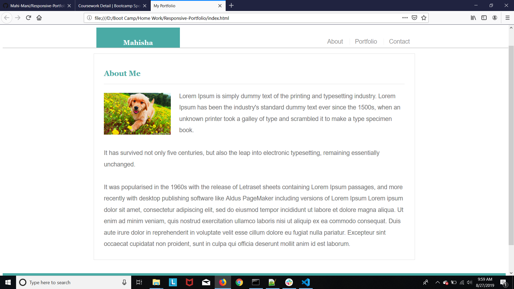
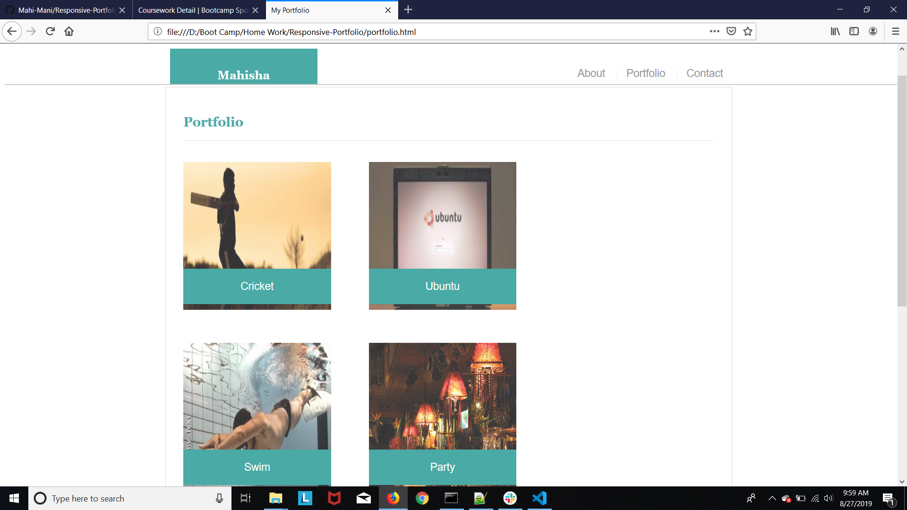
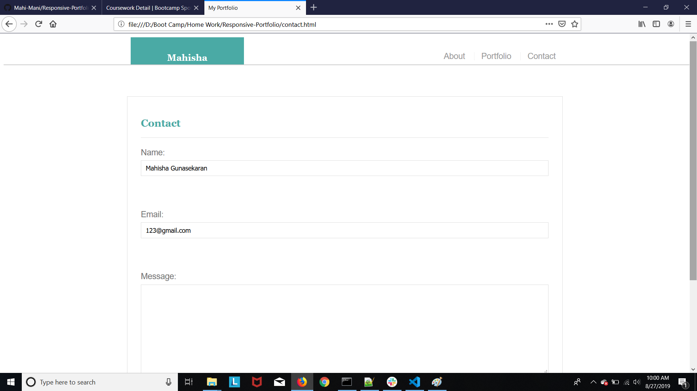

# Responsive Portfolio

## Site pictures




## Technologies Used
- HTML : used to create elements on the DOM
- CSS  : Styles html elements on page
- Media queries : used to make my page device responsive
- Git : version control system to track changes to source code
- GitHub : hosts repository that can be deployed to GitHub pages

## Summary
### Built a professional portfolio site using HTML/CSS/Media Queries. This website basically has three web pages linked to each other. Applied different concepts like divisions, floating, padding added media queries to appear neat and become device responsive.

## Code Snippet
```HTML
        <meta name="viewport" content="width=device-width, initial-scale=1, shrink-to-fit=no">
        <title>My Portfolio</title>
        <link rel="stylesheet" type="text/css" href="assets/css/style.css">

        <body>

                <header id="header">
                  <div class="container">
                    <a href="index.html" id="name">Mahisha</a>
                    <nav>
                      <a href="index.html">About</a>
                      <a href="portfolio.html">Portfolio</a>
                      <a href="contact.html">Contact</a>div
                    </nav>
                  </div>
                </header>
        </body>
```


## Author Links
[LinkedIn](https://www.linkedin.com/in/mahisha-gunasekaran-0a780a88/)

[GitHub](https://github.com/Mahi-Mani)

